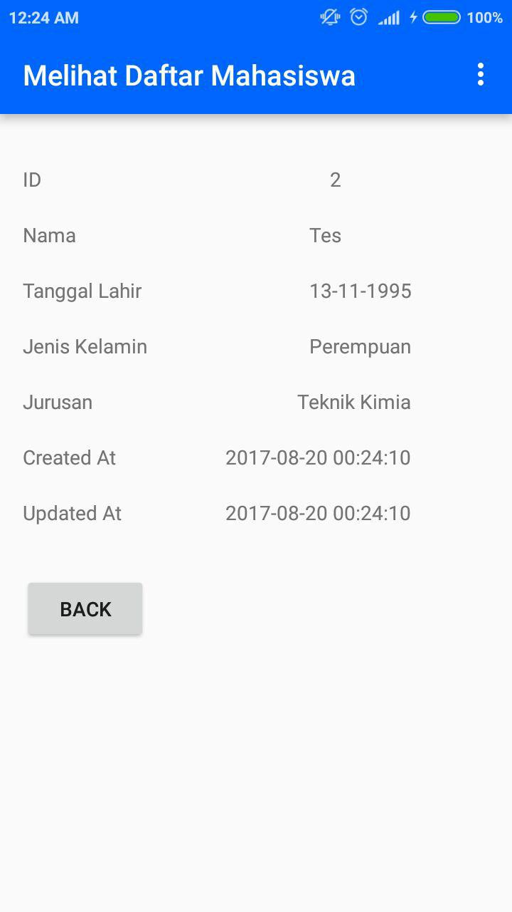

# SodingCRUD
This is a simple app for CRUD (Create, Read, Update, and Delete) using SQLite
this app doing CRUD for College student (Mahasiswa)

Flow of the app : 

First, user enter the app and given interface like in the above picture, "Soding" is default data that Created in the first time user install the app.
After that, user can input new data by click "DAFTAR MAHASISWA BARU" and it  will give user the following interface

User can input name, date of birth, gender, and major of the student, after that click "Simpan" and it will automaticly create new data
like the following picture

We can see that we create new data of student, after that we can click the student name "Tes" and will appear interface like the following picture

There are 3 option there :

  1. Lihat Mahasiswa = If user click this, user can See the detail data of student that user click
  
      
      
  2. Update Mahasiswa = If user click this, user can Update the detail data of student that user click

      
      
  3. Hapus Mahasiswa = If user click this, user can Delete the detail data of student that user click

